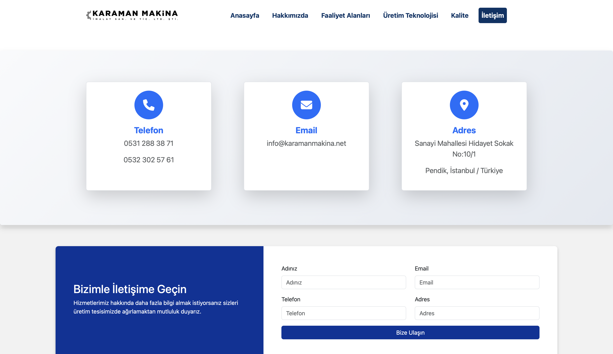

# Karaman Makina Web Sitesi

Karaman Makina, CNC torna ve makine sanayi alanında faaliyet gösteren bir şirkettir. Bu statik web sitesi, şirketin tanıtımı amacıyla HTML, CSS ve JavaScript kullanılarak hazırlanmıştır.

🔗 **Canlı Yayın Adresi**  
https://umutkaraman.github.io/karamanmakina/  
https://www.karamanmakina.net *(Alan adınız)*

## 📁 Proje Yapısı

- `index.html`: Ana sayfa
- `faaliyet.html`, `hakkimizda.html`, `iletisim.html`, `uretim.html`, `kalite.html`: Alt sayfalar
- `/css/`, `/js/`: Stil ve script dosyaları
- Görseller: `.jpg`, `.png` uzantılı tanıtım resimleri

## 🛠️ Kullanılan Teknolojiler

- HTML5  
- CSS3  
- JavaScript  

## 📸 Ekran Görüntüleri

### Ana Sayfa

### Hakkımızda

### Faaliyet Alanları

### Kalite

### İletişim

 

## 📄 Lisans

Bu proje MIT lisansı ile lisanslanmıştır.  
Detaylı bilgi için `LICENSE` dosyasına bakabilirsiniz.
